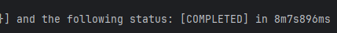

성능 목표 10분내에 1000만건을 넣는거다 

싱글 스레드 spring batch 데이터 1000만건 넣은 시간
8m7s896ms 걸렸다

멀티 스레드로 srpring batch 데이터 1000만건 넣은시간
4m41s439ms 걸렸다 

싱글 스레드 1000만건을 다운받는다
8m19s715ms 쓰레드 적용전 걸린 시간

멀티 스레드 1000만건을 다운받는 시간
3m57s907ms

# 시퀀스 다이어그램 확인
https://mermaid.live

# 배치 다이어그램 
sequenceDiagram
title: CSV 상품 일괄 등록 배치(Batch) 처리 흐름

    participant JobLauncher as Job 실행기
    participant productUploadJob as Job
    participant productUploadStep as Step
    participant productReader as ItemReader
    participant productProcessor as ItemProcessor
    participant productWriter as ItemWriter
    participant CSV_File as CSV 파일
    participant Database as 데이터베이스

    %% 1. Job 실행
    JobLauncher->>productUploadJob: Job 실행 요청 (JobParameters 전달)
    note right of JobLauncher: 사용자가 애플리케이션을 실행하면 JobLauncher가 Job을 시작합니다. 파라미터로 CSV 파일 경로를 전달합니다.

    %% 2. Step 실행
    productUploadJob->>productUploadStep: Step 실행

    %% 3. Chunk 단위 처리 루프 시작
    loop Chunk (1000개 단위) 처리
        %% 3.1. 데이터 읽기 (Read)
        productUploadStep->>productReader: 데이터 읽기 요청
        productReader->>CSV_File: 파일에서 1000줄 읽기
        CSV_File-->>productReader: CSV 데이터 (List<ProductUploadCsvRow>) 반환
        productReader-->>productUploadStep: 읽은 데이터 전달

        %% 3.2. 데이터 가공 (Process)
        productUploadStep->>productProcessor: 데이터 가공 요청 (1개씩 반복)
        note left of productProcessor: ProductUploadCsvRow 객체를 Product 엔티티 객체로 변환합니다.
        productProcessor-->>productUploadStep: 가공된 데이터 (Product) 반환

        %% 3.3. 데이터 쓰기 (Write)
        productUploadStep->>productWriter: 데이터 쓰기 요청 (Chunk 완료 후 한번에)
        productWriter->>Database: INSERT SQL 배치(Batch) 실행
        note right of productWriter: 1000개의 INSERT 문을 한 번의 DB 통신으로 처리하여 성능을 최적화합니다.
        Database-->>productWriter: 실행 완료
        productWriter-->>productUploadStep: 쓰기 완료
    end

    %% 4. Job 종료
    note over productReader, CSV_File: Reader가 파일의 끝에 도달하면 null을 반환하여 루프를 종료합니다.
    productUploadStep-->>productUploadJob: Step 완료
    productUploadJob-->>JobLauncher: Job 완료 (상태: COMPLETED)

# customManager의 수동 메트릭 푸시 동작 과정 = 모니터링
sequenceDiagram
title: CustomManager의 수동 메트릭 푸시 동작 과정

    participant JobListener as Job 리스너 (afterJob)
    participant CustomManager as CustomManager.java
    participant PushgatewaySrv as Pushgateway 서버 (Docker)
    participant PrometheusSrv as Prometheus 서버 (Docker)

    %% --- 1. Job 종료 및 수동 푸시 트리거 ---
    
    JobListener->>CustomManager: pushMetrics(groupingKey) 호출
    activate CustomManager

    note right of JobListener: Batch Job이 종료되면 리스너가 수동 푸시를 시작합니다.

    CustomManager->>PushgatewaySrv: HTTP POST /metrics (메트릭 Push)
    activate PushgatewaySrv
    note over CustomManager,PushgatewaySrv: 수집된 메트릭 데이터를 전송합니다.

    PushgatewaySrv-->>CustomManager: HTTP 200 OK (성공)
    deactivate PushgatewaySrv
    deactivate CustomManager

    %% --- 2. Prometheus의 주기적인 스크레이프 (별개의 프로세스) ---

    loop 5초마다 (scrape_interval)
        PrometheusSrv->>PushgatewaySrv: HTTP GET /metrics (메트릭 수집)
        activate PushgatewaySrv
        
        note left of PrometheusSrv: Prometheus는 설정된 주기에 따라 Pushgateway에 저장된 모든 메트릭을 가져갑니다(Pull/Scrape).

        PushgatewaySrv-->>PrometheusSrv: 저장된 메트릭 데이터 반환
        deactivate PushgatewaySrv
    end

https://cdn.day1company.io/prod/uploads/202410/133107-1636/%EC%B4%88%EA%B2%A9%EC%B0%A8-%ED%8C%A8%ED%82%A4%EC%A7%80--9%EA%B0%9C-%EB%8F%84%EB%A9%94%EC%9D%B8-%ED%94%84%EB%A1%9C%EC%A0%9D%ED%8A%B8%EB%A1%9C-%EB%81%9D%EB%82%B4%EB%8A%94-%EB%B0%B1%EC%97%94%EB%93%9C-%EC%9B%B9-%EA%B0%9C%EB%B0%9C-%ED%8C%8C%ED%8A%B8-5.pdf

https://github.com/dongjoon1251/fastcampus-ecommerce-springbatch

# postgresql 사용방법
https://www.guru99.com/ko/postgresql-create-alter-add-user.html
# postgresql 스크립트 작성할때 public으로 변경후 쿼리 실행

이커머스 시스템의 데이터 처리 및 주요 기능개발
대량 상품 데이터 관리
주요 기능 제공(상품 조회,주문 생성, 결제 처리, 주문 취소)
정확한 보고서 작성
확장성과 유지보수 용이성

# 이커머스 데이터 처리
이 프로젝트는 스프링 배치를 이용하여 신규 이커머스 시스템의 대량 데이터를 처리하고 이커머스의 기능들을 만드는 프로젝트입니다.

## 개발환경 
* Intellij IDEA 
* Java 17
* Gradle 8.14.3
* Spring Boot 3.4.10

## 기술 세부 스택
spring boot
- lombok
- spring data jpa
- spring batch
- QueryDsl(필요하면 추가할 예정)
- apache commons CSV

DB
- postgresql 15

TEST
- H2 Database
- junit-jupiter-api
- junit-jupiter-engine

## ERD 

# 리눅스 명령어
wc -l [파일경로] = 파일의 row 개수를 카운트 
ex) wc -l data/random_product.csv

head -n[가져올 줄 수] [읽어올 파일의 경로] = 파일의 맨위부분터 읽어올 수 있고
head -n7 data/random_product.csv = 7줄만 읽어올 수 있음

head -n7 data/random_product.csv > products_for_upload.csv 
= 테스트할 csv파일을 저장 이렇게 하면 최상단에 만들어진다 

# 각 클래스 설명
ProductGenerator = CSV 데이터 생성기

ReflectionUtils = 클래스 필드명 자동 추출기 , "클래스를 넣으면 그 클래스의 필드 이름들을 자동으로 뽑아주는 도구"
동작 과정
1. ReflectionUtils.getFiledNames(ProductUploadCsvRow.class) 호출 (이거는 ProductGenerator 에 있음)
   ↓
2. ProductUploadCsvRow 클래스 분석
    - sellerId (일반 필드) ✅
    - category (일반 필드) ✅
    - productName (일반 필드) ✅
    - static 필드는 제외 ❌
      ↓
3. ["sellerId", "category", "productName", ...] 반환
   ↓
4. CSV 헤더로 사용
   sellerId,category,productName,...

jobconfig.product.upload = ProductUploadJobConfiguration = job 관련된 설정

# 각 test 클래스 설명
BaseBatchIntegrationTest = 여러 배치 Job 테스트에서 공통으로 사용되는 설정과 유틸리티를 한 곳에 모음

ProductUploadJobConfigurationTest  = 

1. BaseBatchIntegrationTest (추상)
   ├─ 스키마 생성 (@Sql)
   ├─ Spring Batch 테스트 설정
   ├─ 공통 유틸리티 (JobLauncherTestUtils, JdbcTemplate)
   └─ 공통 검증 메서드 (assertJobCompleted)

2. ProductUploadJobConfigurationTest (구체)
   ├─ 특정 Job 활성화 (productUploadJob)
   ├─ 테스트 데이터 준비 (CSV 파일)
   ├─ Job 실행
   └─ 결과 검증 (데이터 개수 + Job 상태)

 이미지 처럼 설명을 달아줘

# 테스트 실패
ProductUploadJobConfigurationTest

1.에러 
Failed to load ApplicationContext for [MergedContextConfiguration@707f4647 testClass = com.ecommerce.batch.jobconfig.product.upload.ProductUploadJobConfigurationTest, locations = [], classes = [com.ecommerce.batch.BatchApplication], contextInitializerClasses = [], activeProfiles = [], propertySourceDescriptors = [PropertySourceDescriptor[locations=[], ignoreResourceNotFound=false, name=null, propertySourceFactory=null, encoding=null]], propertySourceProperties = ["spring.batch.job.name= productUploadJob"], contextCustomizers = [org.springframework.batch.test.context.BatchTestContextCustomizer@3f390d63, org.springframework.boot.test.autoconfigure.OnFailureConditionReportContextCustomizerFactory$OnFailureConditionReportContextCustomizer@424fd310, org.springframework.boot.test.autoconfigure.actuate.observability.ObservabilityContextCustomizerFactory$DisableObservabilityContextCustomizer@1f, org.springframework.boot.test.autoconfigure.properties.PropertyMappingContextCustomizer@0, org.springframework.boot.test.autoconfigure.web.servlet.WebDriverContextCustomizer@463b4ac8, org.springframework.boot.test.context.filter.ExcludeFilterContextCustomizer@1d0d6318, org.springframework.boot.test.json.DuplicateJsonObjectContextCustomizerFactory$DuplicateJsonObjectContextCustomizer@758a34ce, org.springframework.boot.test.mock.mockito.MockitoContextCustomizer@0, org.springframework.test.context.support.DynamicPropertiesContextCustomizer@0], contextLoader = org.springframework.test.context.support.DelegatingSmartContextLoader, parent = null]
Error creating bean with name 'productUploadStep' defined in class path resource [com/ecommerce/batch/jobconfig/product/upload/ProductUploadJobConfiguration.class]: Unsatisfied dependency expressed through method 'productUploadStep' parameter 5: No qualifying bean of type 'org.springframework.batch.item.database.JpaItemWriter<com.ecommerce.batch.domain.product.Product>' available: expected at least 1 bean which qualifies as autowire candidate. Dependency annotations: {}
No qualifying bean of type 'org.springframework.batch.item.database.JpaItemWriter<com.ecommerce.batch.domain.product.Product>' available: expected at least 1 bean which qualifies as autowire candidate. Dependency annotations: {}
Unsatisfied dependency expressed through method 'productUploadJob' parameter 2: Error creating bean with name 'productUploadStep' defined in class path resource [com/ecommerce/batch/jobconfig/product/upload/ProductUploadJobConfiguration.class]: Unsatisfied dependency expressed through method 'productUploadStep' parameter 5: No qualifying bean of type 'org.springframework.batch.item.database.JpaItemWriter<com.ecommerce.batch.domain.product.Product>' available: expected at least 1 bean which qualifies as autowire candidate. Dependency annotations: {}

발생이유
FlatFileItemReader 메서드에서 name이 빠졌기 때문에 발생
.name("productReader") 이렇게 추가해주면 에러 해결 

그리고 오타
@Value("#{jobParameters['inputFilePath]}")  // 잘못됨
@Value("#{jobParameters['inputFilePath']}")  // 올바른 표현

2.에러
org.opentest4j.AssertionFailedError:
expected: 6L
but was: 0L

(PRODUCTS: ""PRODUCT_STATUS"" CHARACTER VARYING(50))"; SQL statement: 베어링 타입이어서 안된다

발생이유
@Enumerated(EnumType.STRING)
private ProductStatus productStatus; 이게 string으로 안 읽혀서 그런다

해결발법
private String productStatus; 이렇게 string으로 변환 시켜주면 된다 
문제는 이거는 일단 임시 방편이다 수정해야한다

3. 에러
   Caused by: org.springframework.batch.core.repository.JobExecutionAlreadyRunningException: A job execution for this job is already running: JobExecution: id=7, version=1, startTime=2025-10-20T16:57:20.065304, endTime=null, lastUpdated=2025-10-20T16:57:20.065304, status=STARTED, exitStatus=exitCode=UNKNOWN;exitDescription=, job=[JobInstance: id=1, version=0, Job=[productUploadJob]], jobParameters=[{}]

java.lang.IllegalStateException: Failed to execute ApplicationRunner

발생이유
이 에러는 동일한 Job이 이미 실행 중일 때 발생합니다. Spring Batch는 기본적으로 동일한 Job이 동시에 여러 개 실행되는 것을 방지하기 위해 이런 에러를 발생
쉽게 정리하면 batch 작업을 하던 도중에 강제종료 해서 전에 작어하던게 남아있기 때문에 충돌하면 서 에러 발생 

// products테이블에 데이터를 한 번 밀어버린다
truncate products;

-- 자식 테이블부터 순서대로 데이터 삭제
DELETE FROM batch_step_execution_context;
DELETE FROM batch_step_execution;
DELETE FROM batch_job_execution_context;
DELETE FROM batch_job_execution_params;
DELETE FROM batch_job_execution;
DELETE FROM batch_job_instance;

해결방법
spring batch 테이블에 있는 데이터를 다 한번 밀어주면 된다 그리고 인텔리제이에서 할거면 꼭 커밋 해주기 

4. 에러
   Setting SQL statement parameter value: column index 1, parameter value [7], value class [java.lang.Long], SQL type unknown
   A job execution for this job is already running: JobExecution: id=7, version=1, startTime=2025-10-20T16:57:20.065304, endTime=null, lastUpdated=2025-10-20T16:57:20.065304, status=STARTED, exitStatus=exitCode=UNKNOWN;exitDescription=, job=[JobInstance: id=1, version=0, Job=[productUploadJob]], jobParameters=[{}]

발생이유

해결 방법
#  Program argument 의 작성 = batchapplication에 작성
--spring.boot.job.names=productUploadjob
inputFilePath=data/rando_product.csv

5. 에러
    Caused by: java.sql.BatchUpdateException: Batch entry 0 insert into products( product_id, seller_id, category, product_name, sales_start_date, sales_end_date,product_status, brand, manufacturer, sales_price, stock_quantity) VALUES (('1762689627228_85d7267d-cc9c-4fee-b855-87d46c59bac8'), ('6'::int8), ('스포츠'), ('햇반'), ('2021-10-03'::date), ('2026-03-06'::date), ('OUT_OF_STOCK'), ('BMW'), ('현대자동차'), ('453427'::int4), ('249'::int4))  was aborted: 오류: "products" 이름의 릴레이션(relation)이 없습니다
발생이유
   Spring Batch Job이 데이터를 삽입하려고 할 때, 데이터베이스에 products 라는 테이블(릴레이션)이 존재하지 않아서 발생하는 오류

2025-11-09T21:00:22.430+09:00  INFO 9316 --- [ecommerce-batch] [           main] .s.d.r.c.RepositoryConfigurationDelegate : Finished Spring Data repository scanning in 41 ms. Found 0 JPA repository interfaces.
이 로그는 Spring이 JPA 엔티티(Entity)나 리포지토리(Repository)를 하나도 찾지 못했음을 의미
즉, Product 엔티티 클래스의 존재를 인식하지 못했기 때문에, ddl-auto 설정에도 불구하고 products 테이블을 만들지 않은 것

해결방법
지금 jdbc로 만들고 있기 때문에 @Entity 어노테이션을 사용 안함 그러므로 
product 테이블을 자체를 db에 생성 하면 끝

6. 에러
   Caused by: org.springframework.batch.core.repository.JobExecutionAlreadyRunningException: A job execution for this job is already running: JobExecution: id=40, version=1, startTime=2025-11-09T23:06:21.825476, endTime=null, lastUpdated=2025-11-09T23:06:21.826479, status=STARTED, exitStatus=exitCode=UNKNOWN;exitDescription=, job=[JobInstance: id=34, version=0, Job=[productUploadJob]], jobParameters=[{'inputFilePath':'{value=data/random_product.csv, type=class java.lang.String, identifying=true}'}]

발생이유:
에러 메시지인 JobExecutionAlreadyRunningException은 말 그대로 **"동일한 Job이 이미 실행 중"**이라는 뜻

Spring Batch는 Job의 이름과 식별(identifying) 파라미터를 조합하여 "동일한 Job인지"를 판단합니다. 로그를 보면, 이전에 실행했던 Job의 정보가 다음과 같이 남아있습니다.

Job 이름: productUploadJob
식별 파라미터: inputFilePath = data/random_product.csv
상태: status=STARTED
종료 시간: endTime=null

이것은 이전에 해당 Job을 실행했다가, 정상적으로 COMPLETED 또는 FAILED 상태로 끝나지 않고 비정상적으로 종료되었음을 의미합니다. 예를 들어, 
실행 중에 IDE에서 중지 버튼을 눌렀거나, 다른 예외가 발생해서 애플리케이션이 강제로 꺼진 경우입니다

이런 경우, Spring Batch의 메타데이터 테이블(BATCH_JOB_EXECUTION)에는 해당 Job이 여전히 "실행 중(STARTED)"인 것처럼 "좀비" 기록이 남게 됩니다.
이 상태에서 동일한 이름과 파라미터로 Job을 다시 실행하려고 하면, Spring Batch는 "어? 이 Job 아직 안 끝났는데 또 실행하려고 하네?"라고 판단하고 중복 실행을 막기 위해 이 예외를 발생시키는 것입니다.

정리
이전에 productUploadJob을 inputFilePath='data/random_product.csv' 파라미터로 실행했다가, 정상적으로 COMPLETED나 FAILED로 끝나지 않고 중간에 강제로 종료되었음을 의미합니다

해결 방법
1. 이전 Job 상태를 'FAILED'로 변경 = 이전 작업을 직접 수정하여 종료된 상태로 변경후 다시 run하면된다
2. 매번 새로운 Job Instance로 실행 이전 Job 기록은 그대로 두고, 매번 실행할 때마다 완전히 새로운 Job으로 인식되도록 만드는 방법입니다. Job을 식별하는 파라미터에 매번 바뀌는 값을 추가
  
만약에 1,2, 번 방법 적용 전에 batch 테이블을 못찾겠었으면 이쿼리로 찾기
SELECT table_schema, table_name
FROM information_schema.tables
WHERE table_name ILIKE 'batch_job_execution';

7. 에러 
19:08:17.002 [Test worker] WARN org.springframework.context.support.GenericApplicationContext -- Exception encountered during context initialization - cancelling refresh attempt: org.springframework.beans.factory.BeanCreationException: Error creating bean with name 'jobLauncherTestUtils': Error creating bean with name 'productUploadJob' defined in class path resource [com/ecommerce/batch/jobconfig/product/upload/ProductUploadJobConfiguration.class]: Unsatisfied dependency expressed through method 'productUploadJob' parameter 1: Error creating bean with name 'batchJobExecutionListener' defined in file [C:\intellij spring\ecommerce-springbatch\ecommerce-batch\build\classes\java\main\com\ecommerce\batch\service\monitoring\BatchJobExecutionListener.class]: Unsatisfied dependency expressed through constructor parameter 0: Error creating bean with name 'customPrometheusPushGatewayManager' defined in file [C:\intellij spring\ecommerce-springbatch\ecommerce-batch\build\classes\java\main\com\ecommerce\batch\service\monitoring\CustomPrometheusPushGatewayManager.class]: Unsatisfied dependency expressed through constructor parameter 1: No qualifying bean of type 'io.prometheus.client.CollectorRegistry' available: expected at least 1 bean which qualifies as autowire candidate. Dependency annotations: {}

발생이유 
 테스트 코드(ProductUploadJobConfigurationTest) 실행중 발생 Spring 컨테이너에서 CollectorRegistry 타입의 Bean을 찾을 수 없어서 발생 

설명
CollectorRegistry =  Prometheus 클라이언트 라이브러리의 핵심 객체입니다. 모든 메트릭(Gauge, Counter 등)은 
이 "메트릭 등록소"에 등록되어야만 수집되고 외부로 전송될 수 있습니다. 애플리케이션 전체에서 
단 하나의 CollectorRegistry 인스턴스를 공유하며 모든 메트릭을 한 곳에 모으는 역할

해결 방법
@AutoConfigureObservability를 BaseBatchIntegrationTest에 넣어주면서 CollectorRegistry가 인지가 된다
이렇게 하면 테스트가 통과가 된다 

8. 에러
   Caused by: java.lang.IllegalStateException: Input resource must exist (reader is in 'strict' mode): file [C:\intellij spring\ecommerce-springbatch\data\random_products.csv]

발생이유
random_products.csv를 찾을수 없어서 발생한 에러이다 

1.
Input resource must exist: "입력 리소스(파일)가 반드시 존재해야 합니다."
2.
(reader is in 'strict' mode): Spring Batch의 ItemReader는 기본적으로 "엄격 모드(strict mode)"로 동작합니다. 이 모드에서는 읽어야 할 파일이 없으면, 즉시 오류를 발생시키고 Job을 실패시킵니다. (안전한 기본 동작입니다.)
3.
file [...]: ItemReader가 찾으려고 시도했던 파일의 정확한 절대 경로입니다.

결론적으로, Spring Batch Job이 시작되었지만, Job 파라미터로 전달받은 경로(C:\intellij spring\ecommerce-springbatch\data\random_products.csv)에 파일이 존재하지 않아서 즉시 실패한 것입니다.

해결 방법
edit configuration 에서
application 에서 program arguments 부분에 csv 파일명을 잘 못 작성  

--spirng.boot.job.names=productUploadJob
inputFilePath=data/random_products.csv,java.lang.String,false

여기서 products 가 아니라 product로 작성 해야 한다 그러면 파일을 못 찾는걸 해결 할 수 있다 

9. 에러
발생이유
로그에 taskExecutor-1, taskExecutor-2, taskExecutor-3 등이 보이는 것은, 사용자가 설정한 멀티 스레드(TaskExecutor)가 정상적으로 동작
하고 있으며 여러 스레드가 동시에 INSERT 작업을 시도하고 있다 

Spring Batch의 기본 FlatFileItemReader는 스레드에 안전하지 않습니다 
= 싱글스레드 동작할때는 상관이 없는데 멀티 스레드로 동작할떄는 FlatFileItemReader가 안전하지 않다는 뜻이다 

이것을 "하나의 수도꼭지"에 비유할 수 있습니다.
1.
FlatFileItemReader = 하나의 수도꼭지: 이 수도꼭지는 한 번에 한 사람만 사용할 수 있습니다. 어디까지 물을 썼는지 내부적으로 기억하고 있습니다.
2.
여러 스레드 (taskExecutor-1, 2, 3...) = 여러 명의 사람들: 이 사람들은 모두 동시에 손을 씻으려고 합니다.
3.
현재 상황: 여러 사람(스레드)이 하나의 수도꼭지(ItemReader)를 동시에 사용하려고 달려듭니다. 서로 "내가 먼저 쓸 거야!"라고 외치며 뒤엉켜, 결국 아무도 제대로 손을 씻지 못하고 **교착 상태(Deadlock)**에 빠져버린 것입니다.
애플리케이션이 멈춘 것처럼 보이는 이유는, 모든 스레드가 서로 파일의 다음 라인을 읽으려고 경쟁하다가 무한 대기 상태에 빠졌기 때문입니다.

쉽게 말하면 동시성 이슈이다 

해결 방법
이 문제를 해결하는 Spring Batch의 표준 방법은, ItemReader 앞에 **"교통정리 요원"**을 배치하는 것입니다. 이 요원의 역할은 한 번에 한 스레드만 ItemReader에 접근하도록 보장하는 것입니다.
이 "교통정리 요원"이 바로 SynchronizedItemStreamReader입니다.
ProductUploadJobConfiguration.java 파일의 productReader Bean을 수정하여, 생성된 FlatFileItemReader를 이 동기화 래퍼(Wrapper)로 감싸주기만 하면 됩니다.

동시성 문제를 해결할려면 하나의 스레드가 하나의 파일에 일정 시간만 점유하고 중간에 락이 걸려있어서
동시에 여러 스레드가 이 파일을 읽지 못하도록 또 동기화된 아이템 리더로 이 리더를 변경해주면 된다 

코드 수정
1. ProductUploadJobConfiguration.java 파일을 엽니다.
2. productReader 메서드를 아래와 같이 수정합니다.
• 메서드의 반환 타입을 구체적인 FlatFileItemReader에서 더 일반적인 인터페이스 ItemReader로 변경합니다.
• 기존에 만들던 FlatFileItemReader를 delegate라는 지역 변수에 저장합니다.
• SynchronizedItemStreamReader를 생성하고, 이 delegate를 감싸도록 설정합니다.
• 최종적으로 동기화된 synchronizedReader를 반환합니다

이 코드를 적용하고 다시 실행하면, 여러 스레드가 ItemReader에 순서대로 접근하게 되어 교착 상태 없이 Job이 끝까지 정상적으로 실행될 것입니다

코드 적용 전
@Bean
@StepScope
public FlatFileItemReader<ProductUploadCsvRow> productReader(
// edit configuration 에서 arg 에 설정 --spirng.boot.job.names=prodcutUploadjob inputFilePath=data/radom_product.csv
@Value("#{jobParameters['inputFilePath']}") String path
){
return new FlatFileItemReaderBuilder<ProductUploadCsvRow>()
.name("productReader")
// 프로젝트 내부 경로를 통해서 파일을 읽어온다
//FileSystemResource는 절대 경로를 기대하지만, @Value("/data/products_for_upload.csv")로 리소스를 로드하면 상대 경로로 처리될 수 있다
.resource(new FileSystemResource(path)) // 읽을 파일
.delimited()//컴마로 나눠진 걸 읽는다
.names(ReflectionUtils.getFiledNames(ProductUploadCsvRow.class).toArray(String[]::new)) // 콤마로 파싱한 다음에 읽어지는 그 값들을 매핑 해준다
.targetType(ProductUploadCsvRow.class)
.linesToSkip(1) // 첫째줄이 header이기 때문에 첫째줄은 넘어가게 한다
.build();
}

코드 적용 후 (동시성 이슈 해결)
@Bean
@StepScope
public SynchronizedItemStreamReader<ProductUploadCsvRow> productReader(
// edit configuration 에서 arg 에 설정 --spirng.boot.job.names=prodcutUploadjob inputFilePath=data/radom_product.csv
@Value("#{jobParameters['inputFilePath']}") String path
){
FlatFileItemReader<ProductUploadCsvRow> productReader = new FlatFileItemReaderBuilder<ProductUploadCsvRow>()
.name("productReader")
// 프로젝트 내부 경로를 통해서 파일을 읽어온다
//FileSystemResource는 절대 경로를 기대하지만, @Value("/data/products_for_upload.csv")로 리소스를 로드하면 상대 경로로 처리될 수 있다
.resource(new FileSystemResource(path)) // 읽을 파일
.delimited()//컴마로 나눠진 걸 읽는다
.names(ReflectionUtils.getFiledNames(ProductUploadCsvRow.class).toArray(String[]::new)) // 콤마로 파싱한 다음에 읽어지는 그 값들을 매핑 해준다
.targetType(ProductUploadCsvRow.class)
.linesToSkip(1) // 첫째줄이 header이기 때문에 첫째줄은 넘어가게 한다
.build();
return new SynchronizedItemStreamReaderBuilder<ProductUploadCsvRow>()
.delegate(productReader)
.build();
}
이렇게 적용하면 스레드 동작에 어떤 락이 걸리기 때문에 앞서서 스레드 세이프하지 않게 
이 잡을 돌렸을때 보다는 더 느리게 돌아가 예정

10. 에러
    java.net.ConnectException: Connection refused: no further information

발생이유
네트워크 연결을 시도하는 부분은 크게 두 곳입니다.
1. PostgreSQL 데이터베이스: localhost:5432
2. Prometheus Pushgateway: pushgateway:9091
이전 로그들을 보면 데이터베이스는 연결이 되어있고 따라서 이 오류는 pushgateway 연결 문제 에러이다 
배치 Job이 거의 끝나갈 무렵, 메트릭을 전송하기 위해 Pushgateway에 접속을 시도하다가 발생했을 확률이 높다
   CustomPrometheusPushGatewayManager가 pushgateway:9091로 데이터를 보내려고 했지만, 해당 주소에서 아무도 연결을 받아주지 않은 것

해결방법
도커에서 pushgateway가 연결이 안되어있어서 발생한 에러이기 때문에 
도커에서 pushgateway를 연결 하면 해결

발생이유

# 제미나이 cli
https://soonmin.tistory.com/132

# 클로드
https://mangkyu.tistory.com/444
https://itsuit.tistory.com/158 이거 보기

[ Claude Code 설치하고 실행하기 ]
# Claude Code 설치
npm install -g @anthropic-ai/claude-code

# 프로젝트 디렉토리로 이동
cd your-project

## Claude Code 실행
claude

# 프로메테우스 & 그라파나 
그람파나에서 프로메테우스 연결할때 localhost 말고
http://localhost:9090
localhost를 대체하는 IP 주소로 사용해야 하는 것은 일반적으로 사용자 컴퓨터에 할당된 IPv4 주소 를 사용

spring-batch-dashboard.json 은 grafana dashboard 파일이다

# 중요
random_product.csv 파일을 다시 만들려면 ProductGenerator.java 클래스만 실행시켜서 파일을 생성하면된다
결론적으로 지금은 만들수가 없으면 초기에 내가 만들었을때 실행해서 만들어진거임

그리고 틀은 그대로 나두고 데이터를 정리할거면 query로 정리하면 된다 
truncate products;

# program arguments 에 넣어야 할거
--spring.boot.job.names=prodcutUploadjob 
inputFilePath=data/random_product.csv,java.lang.String,false
이거를 작성해서 동작하기 

처음에는
--spring.boot.job.names=prodcutUploadjob inputFilePath=data/random_product.csv
inputFilePath=data/random_products.csv 이렇게만 작성하면 된다

스프링 배치 파니셔닝 부터는 이렇게 적용 그리고 gride(쓰레드) 사이즈가 크면 클수록 성능은 더 좋아진다
--spirng.boot.job.names=prodcutUploadjob  inputFilePath=data/random_product.csv,java.lang.String,false gridsize=4,java.lang.Integer,false 이거적용

gridsize는 멀티쓰레드 적용할때 넣으면 된다 

uploadjob을 실행할때는
--spirng.batch.job.name=prodcutUploadjob
inputFilePath=data/random_product.csv,java.lang.String,false
gridSize=10,java.lang.Integer,false 
이거를 넣어준다

downloadjob을 실행할때는
--spirng.batch.job.name=productDownloadJob
outputFilePath=data/products.csv,java.lang.String,false

# 참고할거
싱글 스레드로 동작할 때는 아무 상관이 없는데, 멀티 스레드로 동작할 때는 FlatFileItemReader가 안전하지 않다.

FlatFileItemReader는 단순히 파일을 읽기만 하는 멍청한 기계가 아닙니다. 이 객체는 내부에 중요한 **"상태(State)"**를 가지고 있습니다. 가장 대표적인 상태는 바로 이것입니다.
•
"내가 지금 몇 번째 줄까지 읽었지?"
이 상태 정보(현재 읽고 있는 줄 번호)가 있어야, 다음에 read() 메서드가 호출되었을 때 그 다음 줄을 이어서 읽을 수 있습니다.

# 참고2
로그를 찍는것도 성능에 영향을 미칠수 있기 때문에 잘 작성해야한다 

# 병렬처리를 = 파티셔닝(partitioning) 이라고한다(*중요)
파티셔닝은 스프링 배치에서 하나의 스텝을 여러 개의 작은 스텝으로 나누어서 동시에 실행하는 방법

지금 실행하는 스텝 내에서 리딩 프로세싱,라이팅을 수행을 해주게 되는데 이 작업 자체를 여러
개의 스텝들로 쪼개준다 = 실행되는 범위 자체를 여러 개의 파티션으로 쪼갠다고 보면 된다 

# 지금 발생 하는것
csv 파일 하나를 쓰레드 세이프하게 읽어서 병목이 발생 해결 할 방법으로는
파일을 여러 개로 쪼갠다음에 각 파일을 각 쓰레드에서 처리하면 병목 현상이 줄어든다 
파일을 쪼개는걸 파티셔닝을 통해서 진행 
= 파티셔닝을 통해서 input 파일을 여러 개의 파일로 쪼개고 
그쪼개진 파일들을 Map<String,ExecutionContent>의 ExecutionContent안에 담아준다 
그다음 파티션 핸들러 전달해주면 ExecutionContent의 들어있는 그 쪼개진 파일들을 각각의 쓰레드에서
읽어서 원래 하던 대로 각 쪼개진 파일들에 있는 상품 데이터들을 읽어와서 csv를 대입하는 데이터들을 읽어와서
데이터베이스에 넣을 수 있는 형태를 변환한 후에 각 쓰레드가 별도로 데이터베이스에 저장한다

# downloadjob 실행할때 
wc -l data/products.csv: data/products.csv 파일의 라인 수를 계산하여 출력
이것도 같이 실행해서 10000001 개가 나오는지 확인 