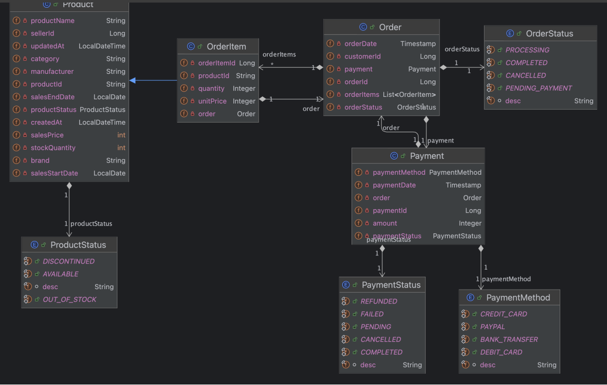
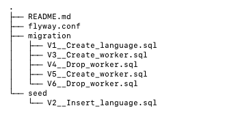

https://cdn.day1company.io/prod/uploads/202410/133107-1636/%EC%B4%88%EA%B2%A9%EC%B0%A8-%ED%8C%A8%ED%82%A4%EC%A7%80--9%EA%B0%9C-%EB%8F%84%EB%A9%94%EC%9D%B8-%ED%94%84%EB%A1%9C%EC%A0%9D%ED%8A%B8%EB%A1%9C-%EB%81%9D%EB%82%B4%EB%8A%94-%EB%B0%B1%EC%97%94%EB%93%9C-%EC%9B%B9-%EA%B0%9C%EB%B0%9C-%ED%8C%8C%ED%8A%B8-5.pdf

https://github.com/dongjoon1251/fastcampus-ecommerce-springbatch

# postgresql 사용방법
https://www.guru99.com/ko/postgresql-create-alter-add-user.html
# postgresql 스크립트 작성할때 public으로 변경후 쿼리 실행

이커머스 시스템의 데이터 처리 및 주요 기능개발
대량 상품 데이터 관리
주요 기능 제공(상품 조회,주문 생성, 결제 처리, 주문 취소)
정확한 보고서 작성
확장성과 유지보수 용이성

# 이커머스 데이터 처리
이 프로젝트는 스프링 배치를 이용하여 신규 이커머스 시스템의 대량 데이터를 처리하고 이커머스의 기능들을 만드는 프로젝트입니다.

## 개발환경 
* Intellij IDEA 
* Java 17
* Gradle 8.14.3
* Spring Boot 3.4.10

## 기술 세부 스택
spring boot
- lombok
- spring data jpa
- spring batch
- QueryDsl(필요하면 추가할 예정)
- apache commons CSV

DB
- postgresql 15

TEST
- H2 Database
- junit-jupiter-api
- junit-jupiter-engine

## ERD 

# 리눅스 명령어
wc -l [파일경로] = 파일의 row 개수를 카운트 
ex) wc -l data/random_product.csv

head -n[가져올 줄 수] [읽어올 파일의 경로] = 파일의 맨위부분터 읽어올 수 있고
head -n7 data/random_product.csv = 7줄만 읽어올 수 있음

head -n7 data/random_product.csv > products_for_upload.csv 
= 테스트할 csv파일을 저장 이렇게 하면 최상단에 만들어진다 

# 각 클래스 설명
ProductGenerator = CSV 데이터 생성기

ReflectionUtils = 클래스 필드명 자동 추출기 , "클래스를 넣으면 그 클래스의 필드 이름들을 자동으로 뽑아주는 도구"
동작 과정
1. ReflectionUtils.getFiledNames(ProductUploadCsvRow.class) 호출 (이거는 ProductGenerator 에 있음)
   ↓
2. ProductUploadCsvRow 클래스 분석
    - sellerId (일반 필드) ✅
    - category (일반 필드) ✅
    - productName (일반 필드) ✅
    - static 필드는 제외 ❌
      ↓
3. ["sellerId", "category", "productName", ...] 반환
   ↓
4. CSV 헤더로 사용
   sellerId,category,productName,...

jobconfig.product.upload = ProductUploadJobConfiguration = job 관련된 설정

# 각 test 클래스 설명
BaseBatchIntegrationTest = 여러 배치 Job 테스트에서 공통으로 사용되는 설정과 유틸리티를 한 곳에 모음

ProductUploadJobConfigurationTest  = 

1. BaseBatchIntegrationTest (추상)
   ├─ 스키마 생성 (@Sql)
   ├─ Spring Batch 테스트 설정
   ├─ 공통 유틸리티 (JobLauncherTestUtils, JdbcTemplate)
   └─ 공통 검증 메서드 (assertJobCompleted)

2. ProductUploadJobConfigurationTest (구체)
   ├─ 특정 Job 활성화 (productUploadJob)
   ├─ 테스트 데이터 준비 (CSV 파일)
   ├─ Job 실행
   └─ 결과 검증 (데이터 개수 + Job 상태)

 이미지 처럼 설명을 달아줘

# 테스트 실패
ProductUploadJobConfigurationTest

1.에러 
Failed to load ApplicationContext for [MergedContextConfiguration@707f4647 testClass = com.ecommerce.batch.jobconfig.product.upload.ProductUploadJobConfigurationTest, locations = [], classes = [com.ecommerce.batch.BatchApplication], contextInitializerClasses = [], activeProfiles = [], propertySourceDescriptors = [PropertySourceDescriptor[locations=[], ignoreResourceNotFound=false, name=null, propertySourceFactory=null, encoding=null]], propertySourceProperties = ["spring.batch.job.name= productUploadJob"], contextCustomizers = [org.springframework.batch.test.context.BatchTestContextCustomizer@3f390d63, org.springframework.boot.test.autoconfigure.OnFailureConditionReportContextCustomizerFactory$OnFailureConditionReportContextCustomizer@424fd310, org.springframework.boot.test.autoconfigure.actuate.observability.ObservabilityContextCustomizerFactory$DisableObservabilityContextCustomizer@1f, org.springframework.boot.test.autoconfigure.properties.PropertyMappingContextCustomizer@0, org.springframework.boot.test.autoconfigure.web.servlet.WebDriverContextCustomizer@463b4ac8, org.springframework.boot.test.context.filter.ExcludeFilterContextCustomizer@1d0d6318, org.springframework.boot.test.json.DuplicateJsonObjectContextCustomizerFactory$DuplicateJsonObjectContextCustomizer@758a34ce, org.springframework.boot.test.mock.mockito.MockitoContextCustomizer@0, org.springframework.test.context.support.DynamicPropertiesContextCustomizer@0], contextLoader = org.springframework.test.context.support.DelegatingSmartContextLoader, parent = null]
Error creating bean with name 'productUploadStep' defined in class path resource [com/ecommerce/batch/jobconfig/product/upload/ProductUploadJobConfiguration.class]: Unsatisfied dependency expressed through method 'productUploadStep' parameter 5: No qualifying bean of type 'org.springframework.batch.item.database.JpaItemWriter<com.ecommerce.batch.domain.product.Product>' available: expected at least 1 bean which qualifies as autowire candidate. Dependency annotations: {}
No qualifying bean of type 'org.springframework.batch.item.database.JpaItemWriter<com.ecommerce.batch.domain.product.Product>' available: expected at least 1 bean which qualifies as autowire candidate. Dependency annotations: {}
Unsatisfied dependency expressed through method 'productUploadJob' parameter 2: Error creating bean with name 'productUploadStep' defined in class path resource [com/ecommerce/batch/jobconfig/product/upload/ProductUploadJobConfiguration.class]: Unsatisfied dependency expressed through method 'productUploadStep' parameter 5: No qualifying bean of type 'org.springframework.batch.item.database.JpaItemWriter<com.ecommerce.batch.domain.product.Product>' available: expected at least 1 bean which qualifies as autowire candidate. Dependency annotations: {}

발생이유
FlatFileItemReader 메서드에서 name이 빠졌기 때문에 발생
.name("productReader") 이렇게 추가해주면 에러 해결 

그리고 오타
@Value("#{jobParameters['inputFilePath]}")  // 잘못됨
@Value("#{jobParameters['inputFilePath']}")  // 올바른 표현

2.에러
org.opentest4j.AssertionFailedError:
expected: 6L
but was: 0L

(PRODUCTS: ""PRODUCT_STATUS"" CHARACTER VARYING(50))"; SQL statement: 베어링 타입이어서 안된다

발생이유
@Enumerated(EnumType.STRING)
private ProductStatus productStatus; 이게 string으로 안 읽혀서 그런다

해결발법
private String productStatus; 이렇게 string으로 변환 시켜주면 된다 
문제는 이거는 일단 임시 방편이다 수정해야한다

3. 에러
   Caused by: org.springframework.batch.core.repository.JobExecutionAlreadyRunningException: A job execution for this job is already running: JobExecution: id=7, version=1, startTime=2025-10-20T16:57:20.065304, endTime=null, lastUpdated=2025-10-20T16:57:20.065304, status=STARTED, exitStatus=exitCode=UNKNOWN;exitDescription=, job=[JobInstance: id=1, version=0, Job=[productUploadJob]], jobParameters=[{}]

java.lang.IllegalStateException: Failed to execute ApplicationRunner

발생이유
이 에러는 동일한 Job이 이미 실행 중일 때 발생합니다. Spring Batch는 기본적으로 동일한 Job이 동시에 여러 개 실행되는 것을 방지하기 위해 이런 에러를 발생

해결방법
네, 테스트 코드에서 JobExecutionAlreadyRunningException이 발생하고 있습니다. 이는 동일한 Job이 이미 실행 중이거나 이전 실행이 비정상 종료되어 여전히 STARTED 상태로 남아있기 때문

4. 에러
   Setting SQL statement parameter value: column index 1, parameter value [7], value class [java.lang.Long], SQL type unknown
   A job execution for this job is already running: JobExecution: id=7, version=1, startTime=2025-10-20T16:57:20.065304, endTime=null, lastUpdated=2025-10-20T16:57:20.065304, status=STARTED, exitStatus=exitCode=UNKNOWN;exitDescription=, job=[JobInstance: id=1, version=0, Job=[productUploadJob]], jobParameters=[{}]

발생이유

해결 방법
#  Program argument 의 작성 = batchapplication에 작성
--spring.boot.job.names=productUploadjob
inputFilePath=data/rando_product.csv

# 제미나이 cli
https://soonmin.tistory.com/132

# 클로드
https://mangkyu.tistory.com/444
https://itsuit.tistory.com/158 이거 보기

[ Claude Code 설치하고 실행하기 ]
# Claude Code 설치
npm install -g @anthropic-ai/claude-code

# 프로젝트 디렉토리로 이동
cd your-project

## Claude Code 실행
claude

